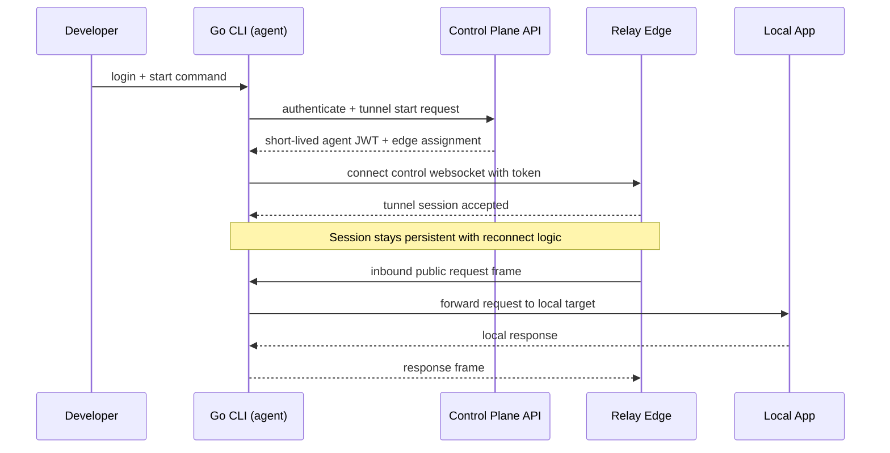
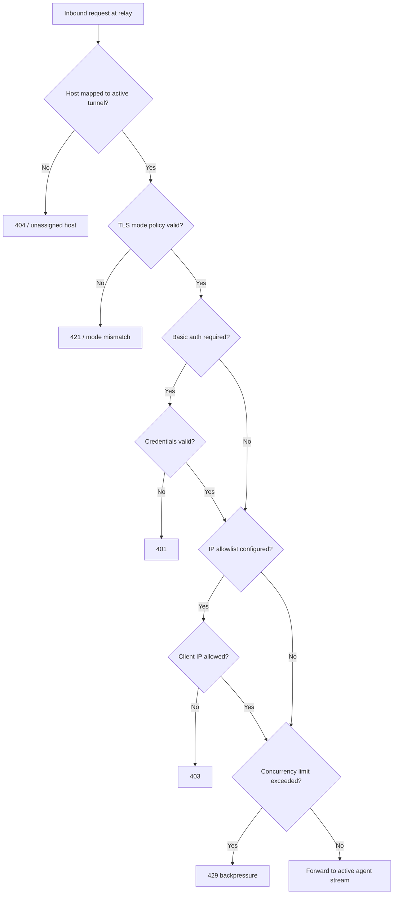
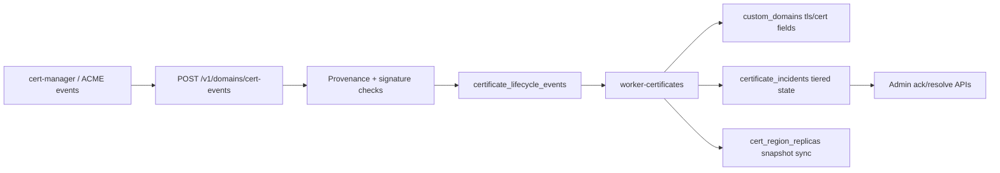
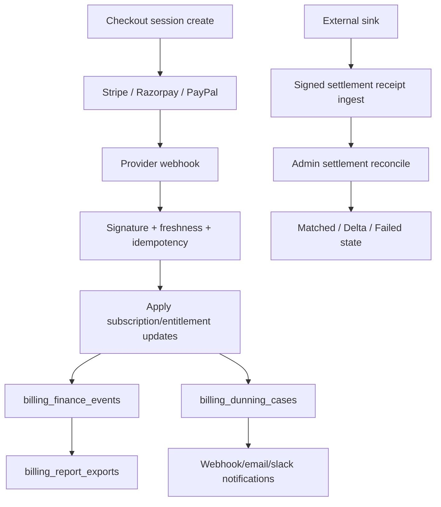

# How It Works

This document explains core platform flows end-to-end:
- tunnel setup and traffic forwarding,
- policy enforcement points,
- certificate lifecycle automation,
- billing and finance reconciliation workflows.

---

## 1) Tunnel Lifecycle (Control + Data Plane)

Key points:
- API owns identity, entitlements, and policy issuance.
- Relay owns real-time enforcement for network traffic.
- CLI/agent owns local forwarding to developer targets.

---

## 2) Edge Security and Routing Decisions

---

## 3) Certificate Lifecycle Flow

Implemented behavior:
- callback-only cert ingest mapping (`callbackClass/callbackAction -> eventType`)
- retry/backoff and DLQ replay controls
- tiered incident tracking (`open`, `acknowledged`, `resolved`)
- region replication state snapshots for multi-region foundations

---

## 4) Billing and Finance Reconciliation Flow

Implemented behavior:
- provider webhook replay/reconcile automation
- report export + delivery ACK lifecycle
- signed settlement receipt ingest and reconciliation with delta metrics

---

## 5) Why This Split Architecture

1. Go for data plane throughput and stable network behavior.
2. TypeScript control plane for speed of product iteration.
3. Worker isolation to keep background concerns independent and retryable.
4. PostgreSQL as source of truth, Redis for ephemeral/coordination state.
5. Monorepo to keep contracts, docs, tests, and infra aligned.

---

## 6) Where to Extend Next

- Strict active-active cert material distribution workflows.
- Expanded multi-region traffic policy drills.
- Broader adaptive abuse controls beyond auth endpoints.
- Stronger enterprise identity and policy controls (deeper SSO/SCIM).

---

## Related References

- `README.md`
- `docs/architecture.md`
- `docs/certificate-lifecycle.md`
- `docs/billing-providers.md`
- `docs/testing-and-ci.md`
- `plan.md`
